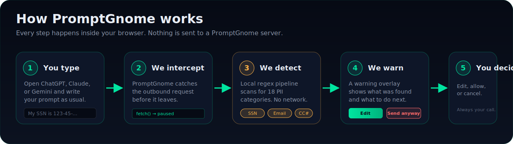

 

**A browser extension that detects sensitive information in your messages to AI chatbots and warns you before you send.**

[Privacy policy](docs/privacy-policy.md) ·
[How it works](docs/how-it-works.md) ·
[Threat model](docs/threat-model.md) ·
[Report a bug](https://github.com/effyyy/PromptGnome/issues/new/choose)

---

## What this repository is

This is the public home for PromptGnome's documentation, trust artifacts, and issue tracker. It does **not** contain the extension's source code.

PromptGnome's source code is currently kept in a private repository. This is a practical choice rather than a permanent one — open-sourcing parts of the project is something we are seriously considering, and community feedback will help shape that decision.

What you can do here:

- Read our [privacy policy](docs/privacy-policy.md), [threat model](docs/threat-model.md), and [data flow](docs/data-flow.md)
- Check the [status of supported AI providers](docs/supported-providers.md)
- File a bug report, feature request, or detection issue
- Report a security vulnerability privately

## How it works

PromptGnome runs entirely inside your browser. When you submit a prompt to a supported AI chatbot, the extension catches the outbound request, runs a local regex pipeline against the prompt text, and — if anything sensitive is found — shows you a warning overlay so you can edit, cancel, or send anyway. **No prompt content ever leaves your machine for a PromptGnome server.**

For the long-form walkthrough, see [`docs/how-it-works.md`](docs/how-it-works.md).

## Brand

PromptGnome's visual identity is built around a calm, trust-forward dark palette with an emerald accent for safety and an amber accent for warnings.

<table>
  <tr>
    <td align="center" width="140">
      
       <b>The Gnome</b>
    </td>
    <td>
      <table>
        <tr>
          <td align="center" bgcolor="#00e5a0"><b><code>#00e5a0</code></b> Emerald · primary</td>
          <td align="center" bgcolor="#00b37d"><b><code>#00b37d</code></b> Emerald dim</td>
          <td align="center" bgcolor="#ffb347"><b><code>#ffb347</code></b> Amber · warning</td>
          <td align="center" bgcolor="#ff6b6b"><b><code>#ff6b6b</code></b> Danger</td>
        </tr>
        <tr>
          <td align="center" bgcolor="#060a14"><b><code>#060a14</code></b> Background</td>
          <td align="center" bgcolor="#0c1220"><b><code>#0c1220</code></b> Surface</td>
          <td align="center" bgcolor="#e8edf5"><b><code>#e8edf5</code></b> Text</td>
          <td align="center" bgcolor="#8a94a8"><b><code>#8a94a8</code></b> Text muted</td>
        </tr>
      </table>
    </td>
  </tr>
</table>

**Type:** Bricolage Grotesque (display) · DM Sans (body) · JetBrains Mono (code).

The mark layers a gnome's hat over a shield-and-lock — protection, but friendly. Brand assets live in [`assets/brand/`](assets/brand).

## Install

| Browser | Status |
|---|---|
| Chrome / Chromium | coming soon |
| Firefox | coming soon |
| Microsoft Edge | coming soon |

## Documentation

- [How it works](docs/how-it-works.md) — a plain-language walkthrough
- [Data flow](docs/data-flow.md) — every network call the extension makes
- [Threat model](docs/threat-model.md) — what we protect against and what we do not
- [Permissions](docs/permissions.md) — every browser permission and why we need it
- [Supported providers](docs/supported-providers.md) — current status per AI chatbot
- [PII types](docs/pii-types.md) — what the detection engine recognizes
- [Privacy policy](docs/privacy-policy.md)
- [Terms of service](docs/terms-of-service.md)
- [FAQ](docs/faq.md)
- [Troubleshooting](docs/troubleshooting.md)

## Reporting a bug or requesting a feature

Please use the [issue templates](https://github.com/effyyy/PromptGnome/issues/new/choose). Each template guides you through the information we need.

If you are reporting a detection issue (a false positive or a false negative), please use **synthetic data only**. Never paste real personal information into an issue.

## Reporting a security vulnerability

Please do not file security issues as public issues. Use [GitHub's private vulnerability reporting](https://github.com/effyyy/PromptGnome/security/advisories/new) or see [SECURITY.md](SECURITY.md) for the full process.

## Changelog

Release notes are maintained in [CHANGELOG.md](CHANGELOG.md) and mirror what is published on the browser extension stores.

## License

The contents of this repository are licensed under [CC BY 4.0](LICENSE). PromptGnome's source code is not distributed via this repository and is not covered by this license.
