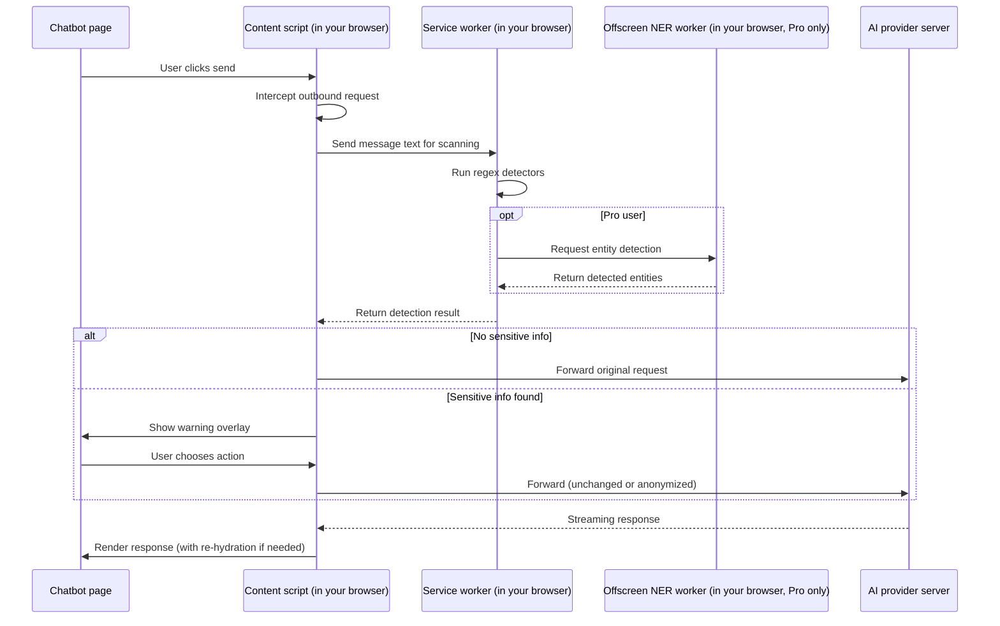

# Data flow

This page describes exactly what happens to your data when you use PromptGnome, and lists every network call the extension makes. If you find a discrepancy between this document and the behavior of the extension, please file an issue or report it as a security concern.

## Lifecycle of a single message

Every box in this diagram lives inside your browser, except for the AI provider server on the far right. No box represents a PromptGnome backend.

## Network call inventory

PromptGnome makes a small, fixed set of network calls. This table is the complete list. If we add a new endpoint, we will document it here in the same release.

| Endpoint | When it is called | What is sent | Contains your message text? | Opt-in required? |
|---|---|---|---|---|
| ExtensionPay license verification | On extension start and periodically thereafter | A license token (no personal info) | No | No (required for paid features to work) |
| Hugging Face CDN model download | The first time you enable Pro on-device detection | A standard HTTPS request for the model file | No | Yes (Pro feature must be enabled) |
| api.promptgnome.com cloud NER analysis | Only when `nerBackendConsent` is true in your settings | Your message text | Yes | Yes, explicit opt-in in settings |
| api.promptgnome.com/v1/detection-feedback | Only when `feedbackConsent` is true and you submit feedback | The feedback payload you compose | Possibly, depending on what you submit | Yes, explicit opt-in in settings |

Outside of these four endpoints, the extension makes **no network calls of any kind**. Specifically:

- No analytics or product telemetry
- No crash reporting
- No A/B testing or feature-flag fetching
- No background sync of any kind
- No third-party tracking pixels, ad libraries, or fingerprinting

## What is stored on your device

- **Your settings**: stored in your browser's standard extension storage. May sync across your devices via your browser's built-in sync, if you have it enabled.
- **The encrypted PII mapping store** (Pro auto-anonymize feature only): AES-256-GCM encrypted entries in IndexedDB, expiring after 24 hours by default.
- **Detection statistics**: numeric counters only. Never the matched text.
- **Audit log entries** (Pro): metadata about detection events. Never the matched text.

## What is never stored anywhere

- The full text of your AI chatbot messages
- The matched values that triggered a detection (only the type and a count)
- Any identifier that links activity back to you personally

## How to verify any of this

The extension is closed source for now, but you can independently verify our network behavior by inspecting traffic:

1. Open your browser's DevTools on a supported chatbot page
2. Switch to the Network tab and enable "Preserve log"
3. Use the chatbot normally
4. Look for requests originating from the extension. The only requests you should see (apart from the chatbot's own traffic) are the four in the table above, and only when their respective conditions apply.

If you find a network call that is not on the list, please [report it as a security issue](../SECURITY.md). We take that seriously.

## Related documents

- [Privacy policy](privacy-policy.md) — the formal version of these commitments
- [Threat model](threat-model.md) — what we protect against and what we do not
- [Permissions](permissions.md) — every browser permission we request and why
