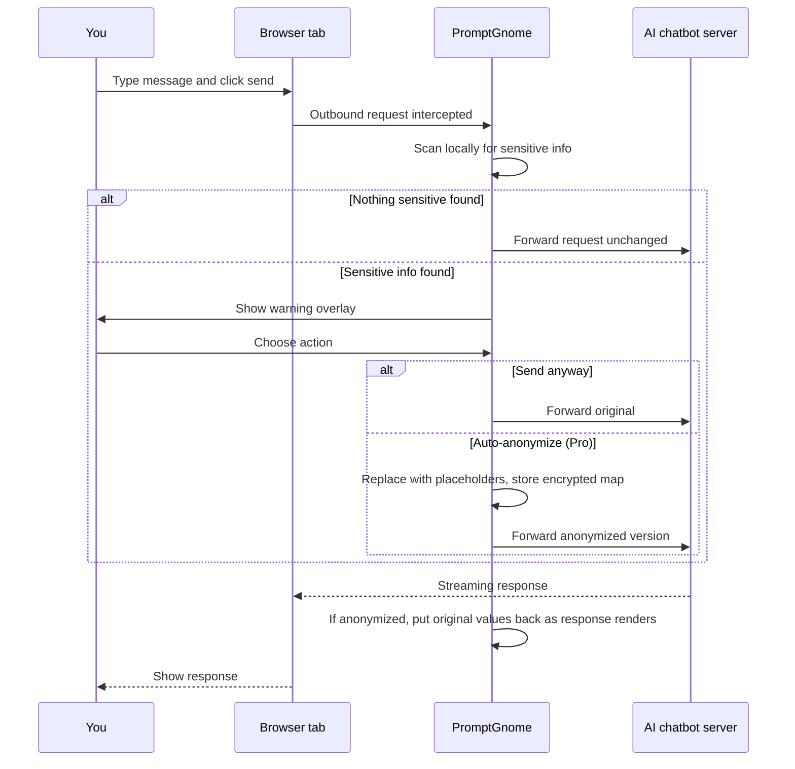

# How PromptGnome works

This page explains, in plain language, what PromptGnome does when you use an AI chatbot. No technical background required.

## The short version

1. You type a message into a supported AI chatbot.
2. Before the message leaves your browser, PromptGnome scans it locally for sensitive information.
3. If something sensitive is found, you see a warning and can choose what to do next.
4. None of this leaves your computer (unless you have explicitly opted in to a specific cloud feature in settings).

## The slightly longer version

When you click send in ChatGPT, Claude, Gemini, or any other supported chatbot, PromptGnome quietly inspects the request before it travels to the provider's servers. The detection runs locally inside your browser, on your device. The original text of your message is never sent to us or to any other server as part of this scan.

If PromptGnome finds something it considers sensitive — for example, an email address, a credit card number, an API key, or (with Pro) a person's name — it pauses the request and shows you a small overlay. You then have a choice:

- **Send anyway**: PromptGnome lets the request proceed unchanged. You stay in control.
- **Edit the message**: you can revise it yourself before sending.
- **Auto-anonymize (Pro)**: PromptGnome replaces the sensitive parts with neutral placeholders like `[EMAIL_1]` or `[NAME_1]`. Only the placeholder version is sent to the AI. The original values stay in an encrypted local map on your device.

When the AI responds, PromptGnome watches the reply as it streams in. If your message had been anonymized, PromptGnome puts your original information back in place as the response renders, so the conversation reads naturally to you while the provider only ever sees the placeholder version.

If PromptGnome does not find anything sensitive, your message goes straight through with no delay and no interruption. Most messages fall into this category.

## A diagram

## What "local" actually means

When we say detection runs locally, we mean it runs inside your browser as part of the extension. There is no background server doing the work. There is no API call to a "scanning service". The regex engine and the on-device machine learning model both execute on your device using your browser's normal extension capabilities.

The two cases where any data related to your messages might leave your device are both opt-in:

- A cloud-based detection backend (off by default; you turn it on if you want higher accuracy and accept the privacy tradeoff)
- A feedback mechanism for reporting false positives and false negatives (off by default; you choose what to send)

Both are listed explicitly in the [data flow](data-flow.md) document.

## What we do not do

- We do not read messages outside the supported AI chatbot domains.
- We do not store the contents of your messages anywhere.
- We do not send analytics, telemetry, crash reports, or any other background traffic.
- We do not change your browser settings, your other extensions, or any other site.

## Where to go next

- [Data flow](data-flow.md) — every network call the extension makes, in a single table
- [Threat model](threat-model.md) — what we protect against and what we do not
- [Permissions](permissions.md) — every browser permission we request and why
- [PII types](pii-types.md) — what kinds of sensitive information are detected
